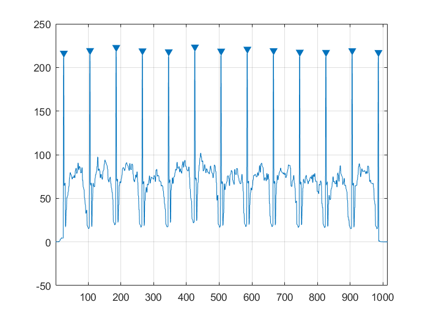
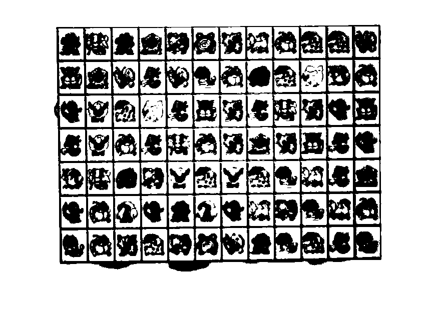
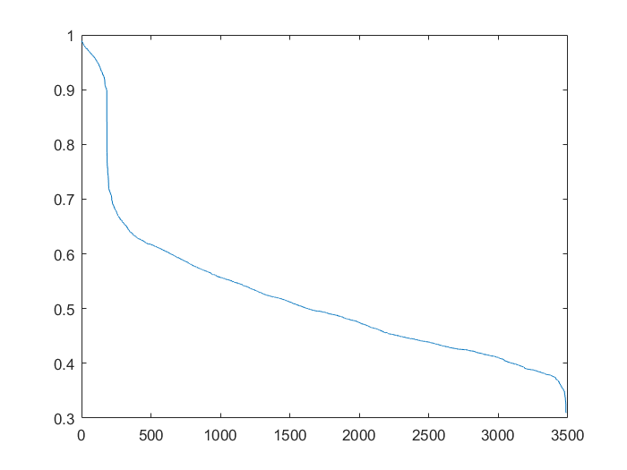
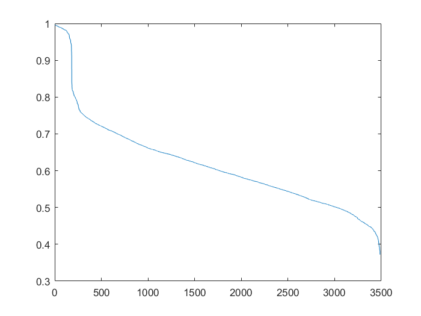
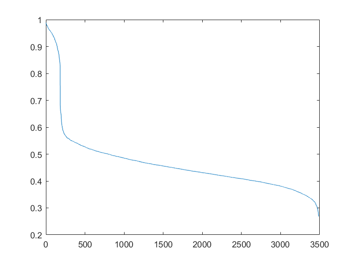
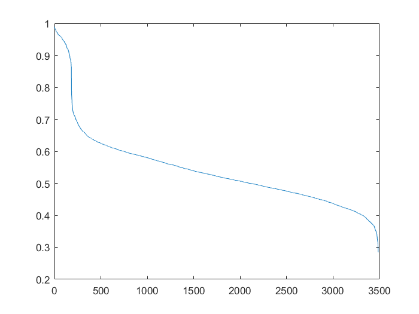

# MATLAB 连连看实验

> 无 76	RainEggplant	2017\*\*\*\*\*\*


## 制作自己的连连看

### 1. 熟悉游戏

游戏界面如下，图中已经消去了几对方块。


### 2. 实现检测块是否可消除的 `detect.m`

连连看可消除的模式如下：


我们先来关注三种连接方式。对于第一种连接方式，只用判断待连接块间是否全为空即可。代码如下：

```matlab
function bool = direct_link(mtx, x1, y1, x2, y2)
    if (x1 == x2)
        bool = ~any(mtx(x1, min(y1, y2)+1 : max(y1, y2)-1));
    elseif (y1 == y2)
        bool = ~any(mtx(min(x1, x2)+1 : max(x1, x2)-1, y1));
    else
        bool = false;
    end
end
```


对于第二种连接方式，可以这样思考：观察以两个待连接块为对角线构成的矩形的另外两个顶点，若其中任意一个顶点为空且能够与两个待连接块直连，则该种连接方式成立。代码如下：

```matlab
function bool = turn_link(mtx, x1, y1, x2, y2)
    bool = (mtx(x1, y2) == 0 && ...
            direct_link(mtx, x1, y1, x1, y2) && ...
            direct_link(mtx, x1, y2, x2, y2)) || ...
            (mtx(x2, y1) == 0 && ...
            direct_link(mtx, x1, y1, x2, y1) && ...
            direct_link(mtx, x2, y1, x2, y2));
end
```


对于第三种连接方式，判定过程如下：

1. 因为下一步待延伸的块可能处于边缘，所以需要先将矩阵向上下左右四个方向零扩展 1 格，即调用 `padarray(mtx, [1, 1])`。
2. 选取待连接块之一，向上下左右的空白处进行最大可能的延伸。
3. 遍历延伸路径上的块，判断其与另一个待连接块间是否存在第二种连接方式。
4. 若存在，则该种连接方式成立。若遍历结束也没有找到存在第二种连接方式，则该种连接方式不成立。

代码如下：

```matlab
function bool = double_turn_link(mtx, x1, y1, x2, y2)
    % 将 mtx 矩阵向四个方向零扩展 1 格
    mtx_ext = padarray(mtx, [1, 1]);
    [m, n] = size(mtx_ext);
    x1_ext = x1+1;
    y1_ext = y1+1;
    x2_ext = x2+1;
    y2_ext = y2+1;
    x_min = x1_ext;
    x_max = x1_ext;
    y_min = y1_ext;
    y_max = y1_ext;
    
    while x_min > 1 && mtx_ext(x_min-1, y1_ext) == 0
        x_min = x_min-1;
    end
    
    while x_max < m && mtx_ext(x_max+1, y1_ext) == 0
        x_max = x_max+1;
    end
    
    while y_min > 1 && mtx_ext(x1_ext, y_min-1) == 0
        y_min = y_min-1;
    end
    
    while y_max < n && mtx_ext(x1_ext, y_max+1) == 0
        y_max = y_max+1;
    end
    
    for x = x_min:x_max
       if (turn_link(mtx_ext, x, y1_ext, x2_ext, y2_ext))
           bool = true;
           return;
       end
    end
    
    for y = y_min:y_max
       if (turn_link(mtx_ext, x1_ext, y, x2_ext, y2_ext))
           bool = true;
           return;
       end
    end
    
    bool = false;
end
```


因此，`detect` 函数的实现代码如下：

```matlab
function bool = detect(mtx, x1, y1, x2, y2)
    % ========================== 参数说明 ==========================
    
    % 输入参数中，mtx为图像块的矩阵，类似这样的格式：
    % [ 1 2 3;
    %   0 2 1;
    %   3 0 0 ]
    % 相同的数字代表相同的图案，0 代表此处没有块。
    % 可以用 [m, n] = size(mtx) 获取行数和列数。
    % (x1, y1) 与 (x2, y2) 为需判断的两块的下标，即判断 mtx(x1, y1) 与
    % mtx(x2, y2) 是否可以消去。
    
    % 注意 mtx 矩阵与游戏区域的图像不是位置对应关系。下标 (x1, y1) 在连连看界面中
    % 代表的是以左下角为原点建立坐标系，x 轴方向第 x1 个，y 轴方向第 y1 个
    
    % 输出参数 bool = 1 表示可以消去，bool = 0 表示不能消去。
    
    %% 在下面添加你的代码 O(∩_∩)O
    
    % [m, n] = size(mtx);
    
    bool = mtx(x1, y1) == mtx(x2, y2) && ...
            (direct_link(mtx, x1, y1, x2, y2) || ...
            turn_link(mtx, x1, y1, x2, y2) || ...
            double_turn_link(mtx, x1, y1, x2, y2));
end
```


以上代码位于 `src/linkgame/detect.m`, 为了能进行测试，我在 `resources/linkgame` 下建立了符号链接，并将 `detect.p` 更名为 `detect.p.example` 。运行 `linkgame.p` 测试一局，算法正确。


### 3. 实现外挂 `omg.m`

外挂的实现采用了一种简单的算法。步骤如下：

1. 统计连连看中包含的方块的种类，即获取 `mtx` 矩阵中出现过的所有非 0 项。

2. 统计每种方块出现位置的坐标，归类放入元胞数组 `pos_of_pattern` 中。

3. 进入循环

   - 从第一种图案开始，将其所有的出现位置两两配对，检查是否能相消。若能，则输出到 `steps` 数组。

   - 一种图案处理完成后，接着处理下一种图案。

   - 所有种类图案都处理完一次后，如果都没有发生消除，则跳出循环并返回；否则，回到 3，开始新一轮循环。


`omg` 函数的代码如下：

```matlab
function steps = omg(mtx)
    % -------------- 输入参数说明 --------------
    
    %   输入参数中，mtx 为图像块的矩阵，类似这样的格式：
    %   [ 1 2 3;
    %     0 2 1;
    %     3 0 0 ]
    %   相同的数字代表相同的图案，0代表此处没有块。
    %   可以用 [m, n] = size(mtx) 获取行数和列数。
    
    %   注意mtx矩阵与游戏区域的图像不是位置对应关系。下标 (x1, y1) 在连连看界面中
    %   代表的是以左下角为原点建立坐标系，x 轴方向第 x1 个，y 轴方向第 y1 个
    
    % --------------- 输出参数说明 --------------- %
    
    %   要求最后得出的操作步骤放在 steps 数组里,格式如下：
    %   steps(1) 表示步骤数。
    %   之后每四个数 x1 y1 x2 y2，代表把 mtx(x1,y1) 与 mtx(x2, y2) 表示的块相连。
    %   示例： steps = [2, 1, 1, 1, 2, 2, 1, 3, 1];
    %   表示一共有两步，第一步把 mtx(1, 1) 和 mtx(1, 2) 表示的块相连，
    %   第二步把 mtx(2, 1) 和 mtx(3, 1) 表示的块相连。
    
    %% --------------  请在下面加入你的代码 O(∩_∩)O~  ------------
    
    steps(1) = 0;
    
    % 获取图案种类
    patterns = unique(mtx);
    patterns = patterns(patterns ~= 0);
    
    % 获取每种图案出现的位置
    pos_of_pattern = {};
    for pattern = patterns'
        [x, y] = find(mtx == pattern);
        pos_of_pattern(end+1) = {[x, y]};
    end
    
    while true
        available = false;
        for k = 1:length(pos_of_pattern)
           pairs = pos_of_pattern{k};
           
           % 两两比对
           p1 = 1;
           while p1 <= length(pairs)
              p2 = p1+1;
              while p2 <= length(pairs)
                 pos_1 = pairs(p1, :);
                 pos_2 = pairs(p2, :);    
                 if detect(mtx, pos_1(1), pos_1(2), ...
                         pos_2(1), pos_2(2))
                     % 消除成功，输出到 steps
                     steps(1) = steps(1) + 1;
                     steps = cat(2, steps, pos_1, pos_2);
                     
                     % 从矩阵与坐标记录中移除消除的块
                     mtx(pos_1(1),  pos_1(2)) = 0;
                     mtx(pos_2(1),  pos_2(2)) = 0;
                     pairs(p1, :) = [];
                     pairs(p2-1, :) = [];
                     p1 = p1-1;
                     
                     available = true;
                     break;
                 else
                    p2 = p2+1;
                 end
              end
              p1 = p1+1;
           end
           pos_of_pattern{k} = pairs;
        end
        
        if ~available
            % 整轮循环都没有检测到可消除块，则跳出并返回
            break;
        end
    end
end
```


以上代码位于 `src/linkgame/omg.m`, 为了能进行测试，我在 `resources/linkgame` 下建立了符号链接，并将 `omg.p` 更名为 `omg.p.example` 。运行 `linkgame.p` 测试一局自动模式，算法正确。


## 攻克别人的连连看

### 1. 提取游戏截图（灰度）的分块

> 本节代码位于 `src/process/segment_screenshot.m`

因为背景（水平、竖直线）的周期明显，而图案的周期性不明显，所以我们可以对所有的水平线或竖直线上的灰度值取均值，以去除各行数据上的随机性影响。

因此写出代码：

```matlab
% 求水平方向的平均灰度值，并反色以便寻峰
row_avg = 255-mean(img, 1);
figure;
plot(row_avg);
title('反色后的平均灰度值（水平）');
```

结果如下：



可见，每条分割线对应了非常突出的峰值。因此，我们使用 `findpeaks` 函数就可轻松得到结果。

因此写出代码，

```matlab
% 寻峰，获得垂直分割线坐标
[~, col_locs] = findpeaks(row_avg, 'MinPeakProminence', 128);
n_col = length(col_locs)-1;
```


对垂直方向进行相同操作。


最终，我们获得了水平分割线条数 `n_row`, 垂直坐标 `row_locs`, 垂直分割线条数 `n_col`, 垂直坐标 `col_locs`。因此，编写代码对图像进行分割：

```matlab
% 输出分割后的图像
figure('Position',  [200 200 500 400]);
idx = 1;
for row = 1:n_row    
	for col = 1:n_col
		subplot(n_row, n_col, idx);
        imshow(img(row_locs(row):row_locs(row+1)-1, ...
        col_locs(col):col_locs(col+1)-1));
        idx = idx+1;
	end
end    
```


结果如下：


可见效果非常好。


### 2. 提取摄像头拍摄的图像（灰度）分块

> 本节代码位于 `src/process/segment_camera.m`

因为原始图像对比度不够，为了方便处理，先对图像进行二值化。

```matlab
img_b = imbinarize(img, 0.8);
```

效果如下：



然后再采用 1 中的办法。

反色后的平均灰度值（水平）结果如下：


反色后的平均灰度值（垂直）结果如下：


仍然调用 `findpeaks` 函数寻峰。但是这里需要额外关注一下函数参数。

```matlab
[~, col_locs] = findpeaks(row_avg, 'MinPeakProminence', 0.3, ...
        'MaxPeakWidth', 10);
[~, row_locs] = findpeaks(col_avg, 'MinPeakProminence', 0.3, ...
        'MaxPeakWidth', 10);
```

因为边框处和周围的对比是很明显的，而图案形成的峰没有这种性质，所以要求 `MinPeakProminence = 0.3`。同时，边框的宽度很窄，而图案形成的峰也没有这种性质，因此要求 `MaxPeakWidth = 10`。这样我们就可以选出边框对应的峰值了。


最后分割结果如下：


可见效果仍然不错。


#### 注：

在处理 1、2 问时，我曾经尝试使用老师提到的傅里叶变换的方式，但是最后的结果却没有现在的好。稍作分析，现在的方式有以下优点：

- 相对傅里叶变换而言，运算量更少。
- 应对具有轻微透视变形的图像效果更好。原因是傅里叶变换只能得到基频和相位，即对应图像块的尺寸和最边上的偏移量。但是对于具有透视变形的图像，其图像块尺寸并不均匀。如果以固定尺寸去分割，不能保证每一块都分割地合适，同时误差可能会有累积效应（例如图像块左小右大，那么在从左向右分割时，图像块大小达到平均前误差都在持续积累）。
- 选用合适的阈值对图像进行二值化可明显地减小噪声影响。


最后我们将这两节的思路整合，定义函数 `segment_image` （位于 `src/process/segment_image.m`）, 参数如下：

```matlab
function [segments, segment_locs] = segment_image(...
    img, BinThreshold, MinPeakProminence, MaxPeakWidth)
```

| 参数              | 描述                    |
| ----------------- | ----------------------- |
| img               | 图像矩阵                |
| BinThreshold      | 二值化阈值, 取值 [0, 1] |
| MinPeakProminence | 峰值最小的突出程度      |
| MaxPeakWidth      | 峰值最大的宽度          |

返回值 `segments` 是一个 m$\times$n 维元胞数组，对应分割后的每一块图像。`segment_locs` 为每块图像的位置信息，为 `[left bottom width height]`  形式的四元素向量。


### 3.  计算所有图像分块的两两相似性

#### 设计二维高通滤波器

> 本节代码位于 `src/process/filter_high_pass.m`

直观地看，每个图像分块区别于其他图像分块的重要特征是纹理。为了凸显纹理，可以用高通滤波器去除图像中缓慢变化的部分。

首先，我们先设计一个一维的高通滤波器。

```matlab
filter_1d = fir1(order, freq, 'high');
```

其单位样值响应如下（`order=20, freq=0.35`) :


然后，我们旋转该样值响应，得到二维的高通滤波器。

```matlab
mid = order/2+1;
d_square_max = (mid-1)^2;
    
% “旋转”一维滤波器，构造二维高通
filter_2d = zeros(order+1, order+1);
for x = 1:order+1
	for y = 1:order+1
		d_square = (x-mid)^2+(y-mid)^2;
		if d_square <= d_square_max
			filter_2d(x, y) = filter_1d(mid-round(sqrt(d_square)));
		end
	end
end
```

二维高通滤波器的响应如下：


加入直流分量，让我们看一看滤波前后的对比效果：


可见，该滤波器的确提取出了图像的纹理信息。


#### 计算相关系数

> 本节代码位于 `src/process/calc_corrs.m`

得到二维高通滤波器后，我们先对所有图像块进行高通滤波。

```matlab
filter_2d = filter_high_pass(order, freq);
segments_hf = cellfun(@(x) filter2(filter_2d, x, 'same'), ...
   segments, 'UniformOutput', false);
```

然后逐一计算相关系数，

```matlab
n_segments = numel(segments_hf);
corrs = zeros(n_segments*(n_segments-1)/2, 3);
idx = 1;
for k = 1:numel(segments_hf)-1
	for m = k+1:numel(segments_hf)
		img1 = segments_hf{k};
		img2 = segments_hf{m};
		[cut_height, cut_width] = round(size(img1)*edge_factor);
        img1_s = img1(cut_height:end-cut_height, cut_width:end-cut_width);
        [cut_height, cut_width] = round(size(img2)*edge_factor);
        img2_s = img2(cut_height:end-cut_height, cut_width:end-cut_width);
        c1 = normxcorr2(img1_s, img2);
        c2 = normxcorr2(img2_s, img1);
		corrs(idx, :) = [max(max(c1(:)), max(c2(:))), k, m];
		idx = idx+1;
	end
end

corrs = sortrows(corrs, 'descend'); 
```

需要注意的是，由于图像块尺寸大小不完全一致，同时分割时还可能包含部分边框，我们采用了如下方式处理：选择两块图像中的一块，先切除一定宽度的边沿，然后将被切除的图像块作为模板滑动计算相关；再选择另一块做同样的操作。然后，取所有相关系数的最大值作为结果。

在解决本问的过程中，最开始我采用通过 `padarray` 扩大图像来解决图像大小不一导致无法使用 `normxcorr2` 函数的问题。但是我忽略了边框对于相关的影响，最后的结果并不理想。最后采用上面的方式，结果还是很令人满意的。


#### 测试不同参数下的相关系数分布和正确性

为了便于比对图像，我编写了图形界面如下：

> 该图形界面对应文件：`src/process/show_matches_gui.m`, `src/process/show_matches_gui.fig`


该窗口从工作区读取图像分块 `segments` 和相关系数信息 `corrs`, 展示每一对图像以及编号、相关系数等，支持上下翻页和跳转。


我们采用摄像头取得的图像，测试不同参数下的相关系数分布和正确性：

- 不进行高通滤波

  

  经检查，相关系数最大的前 182 对均正确配对，实际上，这已经涵盖了所有正确的配对。并且，最后一对正确配对与下一对的相关系数为 0.8962 和 0.7857，变化较陡峭。从相关系数整体来看，区分度也不错。

  

- `calc_corrs(segments, 20, 0.2, 0.1)`

  

  经检查，程序也正确地完成了所有的配对。但是，最后一对正确配对与下一对的相关系数为 0.91 和 0.8425，变化没有那么陡峭了。从相关系数整体来看，区分度也没有前一种好。


- `calc_corrs(segments, 20, 0.35, 0.1)`

  

  经检查，程序正确地完成了所有的配对。最后一对正确配对与下一对的相关系数为 0.8256 和 0.6847，变化非常陡峭。从相关系数整体来看，区分度也非常好。


- `calc_corrs(segments, 20, 0.5, 0.1)`

  

  经检查，程序正确地完成了所有的配对。最后一对正确配对与下一对的相关系数为 0.8647 和 0.7922，变化没有那么陡峭了。


综上所述，我们得出如下结论：

- 不采用高通滤波的图像因为含有完整的信息，也能起到较好的效果。
- 采用高通滤波时，截止频率的选取非常关键：
  - 若截止频率过低，则不能有效地提取图形纹理，反而可能因为损失部分图像信息，造成区分度和准确性下降。
  - 若截止频率过高，则会因为滤除了太多有效信息，导致区分度和准确性下降。
  - 只有截止频率适合时，才能提高区分度与准确性。

在本例中，采用 `order=20, freq=0.35` 是非常合适的。


#### 展示最相似的十对图像块

> 本节代码位于 `src/process/show_matches.m`

调用 `show_matches(segments, corrs, 0)` 即可输出。


### 4. 展示相似度最大但不是同一种精灵的十对图像块

先前已经通过 GUI 程序得到所有不是同一种精灵的匹配出现在第 182 项以后。故调用 `show_matches(segments, corrs, 182)` 即可输出结果。


看来程序觉得小锯鳄和妙蛙种子长得比较像，这对 CP 十次里出现了 5 次。但从我的主观感受上来看，二者并没有那么像，只是角度比较一致。另外一对 CP 波波和绿毛虫也出现了 5 次，我也觉得是因为他们角度比较一致，然后尾巴处都有一团灰色的东西。


### 5. 分类图像块，将游戏区域映射为索引矩阵

思路如下：按相关系数从高往低，利用给定相关系数阈值以上的配对信息，将图案归类（若信息不足将忽略阈值尝试分类）。第一次处理后，还存在一种图案对应多个 `patterns` 的现象。第二次处理会将相同的 `pattern` 合并，然后更新游戏索引矩阵。 

代码如下：（文件位于 `src/process/map_to_matrix.m`）

```matlab
function [game_mat, patterns] = map_to_matrix(mat_size, corrs, threshold)
    game_mat = zeros(mat_size);
    patterns = {};
    
    % 优先使用相关系数高的数据进行归类
    for k = 1:length(corrs)
        % 相关系数已低于阈值，并且每一块已被检测过时，结束归类
        if corrs(k,1) < threshold && all(game_mat(:))
            break; 
        end
        
        p1 = corrs(k, 2);
        p2 = corrs(k, 3);
        mapped = false;
        
        for m = 1:length(patterns)
            if any(patterns{m} == p1)
                game_mat(p2) = m;
                patterns{m}(end+1) = p2;
                mapped = true;
                break;
            elseif any(patterns{m} == p2)
                game_mat(p1) = m;
                patterns{m}(end+1) = p1;
                mapped = true;
                break;
            end
        end
        
        if ~mapped
           patterns{end+1} = [p1, p2];
           game_mat(p1) = length(patterns);
           game_mat(p2) = length(patterns);  
        end
    end
    
    % 合并相同的 pattern
    for k = 1:max([patterns{:}])
        idx = find(cellfun(@(x) any(x==k), patterns));
        if length(idx) > 1
            patterns{idx(1)} = unique([patterns{idx}]);
            patterns(idx(2:end)) = [];
        end
    end
    
    % 利用新的 pattern 编号更新索引矩阵
    for k = 1:length(patterns)
       game_mat(patterns{k}) = k; 
    end
end
```


矩阵 `game_mat` 如下，与游戏显示的位置是一致的：

<table>
 <tr>
  <td>7</td>
  <td>11</td>
  <td>7</td>
  <td>4</td>
  <td>13</td>
  <td>18</td>
  <td>6</td>
  <td>12</td>
  <td>1</td>
  <td>5</td>
  <td>5</td>
  <td>14</td>
 </tr>
 <tr>
  <td>9</td>
  <td>4</td>
  <td>14</td>
  <td>8</td>
  <td>14</td>
  <td>3</td>
  <td>1</td>
  <td>15</td>
  <td>5</td>
  <td>17</td>
  <td>19</td>
  <td>1</td>
 </tr>
 <tr>
  <td>10</td>
  <td>2</td>
  <td>5</td>
  <td>17</td>
  <td>8</td>
  <td>9</td>
  <td>6</td>
  <td>8</td>
  <td>11</td>
  <td>6</td>
  <td>10</td>
  <td>9</td>
 </tr>
 <tr>
  <td>8</td>
  <td>2</td>
  <td>1</td>
  <td>8</td>
  <td>11</td>
  <td>1</td>
  <td>6</td>
  <td>4</td>
  <td>6</td>
  <td>9</td>
  <td>8</td>
  <td>10</td>
 </tr>
 <tr>
  <td>19</td>
  <td>11</td>
  <td>15</td>
  <td>13</td>
  <td>2</td>
  <td>5</td>
  <td>2</td>
  <td>5</td>
  <td>3</td>
  <td>12</td>
  <td>8</td>
  <td>4</td>
 </tr>
 <tr>
  <td>10</td>
  <td>1</td>
  <td>16</td>
  <td>10</td>
  <td>7</td>
  <td>16</td>
  <td>10</td>
  <td>12</td>
  <td>13</td>
  <td>3</td>
  <td>12</td>
  <td>1</td>
 </tr>
 <tr>
  <td>3</td>
  <td>1</td>
  <td>6</td>
  <td>5</td>
  <td>13</td>
  <td>18</td>
  <td>14</td>
  <td>7</td>
  <td>3</td>
  <td>5</td>
  <td>8</td>
  <td>3</td>
 </tr>
</table>


调用 `print_legend(segments, patterns)`（文件位于 `src/process/print_legend.m`）, 输出图例如下：


我们成功地将每一块图案映射为矩阵中的索引。


### 6. 设计一个模拟的自动连连看

在上一节中，我们已经得到了图像对应的索引矩阵。因此，我们可以直接使用 `omg.m` 生成消除步骤。

我们定义了函数 `play_simulation(img, segment_locs, game_mat)` 用于演示模拟的自动连连看。`img`, `segment_locs` 和 `game_mat` 分别是游戏图像、调用 `segment_image` 得到的分块位置信息和调用 `map_to_matrix` 得到的索引矩阵。

该函数代码如下，（文件位于 `src/process/play_simulation.m`）

```matlab
function play_simulation(img, segment_locs, game_mat)
    addpath('../linkgame');
    steps = omg(game_mat);
    figure;
    ax_game = subplot('Position', [0.05 0.05 0.78 0.9])
    imshow(img);
    hold on;
    ax_pair1 = subplot('Position', [0.85 0.25 0.1 0.2])
    ax_pair2 = subplot('Position', [0.85 0.55 0.1 0.2])
    
    for k = 1:steps(1)
       locs1 = segment_locs{steps(4*k-2), steps(4*k-1)};
       locs2 = segment_locs{steps(4*k), steps(4*k+1)};
       axes(ax_pair1);
       imshow(img(locs1(2):locs1(2)+locs1(4)-1, ...
           locs1(1):locs1(1)+locs1(3)-1));
       axes(ax_pair2);
       imshow(img(locs2(2):locs2(2)+locs2(4)-1, ...
           locs2(1):locs2(1)+locs2(3)-1));
       axes(ax_game);
       rectangle('Position', locs1, 'EdgeColor','r', 'LineWidth', 2);
       rectangle('Position', locs2, 'EdgeColor','r', 'LineWidth', 2);
       pause(1);
       rectangle('Position', locs1, 'FaceColor','k', 'LineWidth', 2);
       rectangle('Position', locs2, 'FaceColor','k', 'LineWidth', 2);
       pause(0.5);
    end      
end
```

该函数会在左侧逐步展示消除过程，并在右侧放大显示当前消除的块，便于检验程序正确性。


从头开始，完整的调用流程如下：

```matlab
img = imread('../../resources/process/graycapture.jpg');
[segments, segment_locs] = segment_image(img, 0.8, 0.3, 10);
corrs = calc_corrs(segments, 20, 0.35, 0.1);
[game_mat, patterns] = map_to_matrix(size(segments), corrs, 0.8);
play_simulation(img, segment_locs, game_mat);
```


效果如下：


## 选做：设计真实的自动连连看

### 连接摄像头

我们采用 IP Camera 的方式，用手机作为摄像头。

首先，我们需要安装为 MATLAB 安装硬件支持包 `MATLAB Support Package for IP Cameras` 。同时，我们也需要在手机上安装一款 IP 摄像头软件，我用的是 [这款](https://play.google.com/store/apps/details?id=com.pas.webcam) 。然后，让手机和电脑处于同一局域网下，开启手机的视频流服务。

让我们访问摄像头的址看一看效果：


可以看到，我们成功地连接了手机摄像头与电脑。


### 完成 `user_camera.m`

和老师提供的硬件连接模式不同，由于我们使用的是 IP Camera 的方式，需要能传入摄像头的地址。可惜 `user_camera` 不支持传入参数。因此，我们只好采用全局变量的方式。

在命令行中键入如下命令以完成全局变量的设置：

```matlab
global cam_ip;
cam_ip = 'http://192.168.137.120:8080/video'
```

然后完成 `user_camera.m` :

```matlab
function realcapture = user_camera()
    global cam_ip;    % 需要提前在工作区定义全局变量 cam_ip
    persistent cam;   % cam 是静态变量
    % 如果空则说明第一次调用本函数，创建新的视频对象，这样做是为了避免重复生成，提高执行速度
    if isempty(cam)
        cam = ipcam(cam_ip);
        pause(5);
    end
    realcapture = snapshot(cam);
    realcapture = rgb2gray(realcapture);
    width = size(realcapture, 1);
    realcapture = realcapture(:, 1:round(width*1.32));
end
```

注意我们对摄像头获取的图片进行了灰度处理，同时根据窗口的宽高比裁减了图像。使用时，保证窗口的高度充满摄像头的屏幕即可。第一次调用时会等待 5 秒后才拍摄图像，原因是按键精灵调整窗口位置到左上角有延迟。测试时请根据实际情况调整该值，并注意每次测试前重置 persistent 变量。

以上代码位于 `src/linkgame/user_camera.m`, 为了能进行测试，我在 `resources/linkgame` 下建立了符号链接，并将 `user_camera.m` 更名为 `user_camera.m.example` 。


### 完成 `ai.m`

为了能够充分复用之前的代码，我们仅在游戏开始时读取游戏区域，进行识别与计算。之后每次仅需从以计算好的步骤中返回当前步骤即可（我们使用了 persistent 变量来保证这一功能，注意每次测试前需要重置该变量）。

由于摄像头获取的图像较暗，我们将二值化的阈值从 `0.8` 调整为 `0.6`。同时，需要注意 `step` 中坐标的定义和 `game_mat` 不同，需要额外处理。

```matlab
function step = ai(realcapture)   
    addpath('../../src/linkgame');
    addpath('../../src/process');
    persistent steps;
    persistent counter;
    if isempty(counter)
        % 第一次调用本函数，读取图片，生成所有消除步骤
        counter = 1;
        [segments, segment_locs] = segment_image( ...
            realcapture, 0.6, 0.3, 10);
        display(size(segments));
        corrs = calc_corrs(segments, 20, 0.35, 0.1);
        [game_mat, patterns] = map_to_matrix( ...
            size(segments), corrs, 0.8);
        game_mat = flipud(game_mat);
        steps = omg(game_mat);
        display(steps);
    else
        counter = counter+1;
    end
    
    if counter <= steps(1)
        step = steps([counter*4-1, counter*4-2, counter*4+1, counter*4]);
        display(step);
    else
        step = -1;
        clear counter;
    end
end
```

以上代码位于 `src/linkgame/ai.m`, 为了能进行测试，我在 `resources/linkgame` 下建立了符号链接，并将 `ai.m` 更名为 `ai.m.example` 。


### 效果

如下（PDF 档无法嵌入 gif）：


完整视频请参见项目下的 `showtime.mp4` 。

